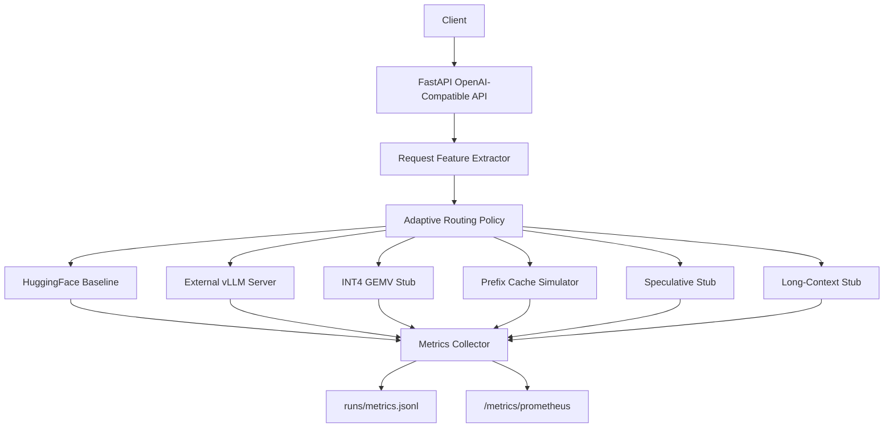

<div align="center">

# Adaptive LLM Inference Router

### Workload-aware routing across decode, cache, vLLM, speculative, and long-context inference paths

[](#installation)
[](#openai-compatible-api)
[](#key-results)
[](#vllm-on-windows--wsl)
[](LICENSE)

**A local LLM serving engine that decides, per request, which inference path should run.**

`baseline HF` | `external vLLM` | `INT4 GEMV stub` | `prefix-cache simulator` | `speculative stub` | `long-context/KV-aware stub`

</div>

---

## TL;DR

> The fastest LLM inference path is workload-dependent. Batch-1 short decode, batch-2+ matmul reuse, shared-prefix prompts, long-context KV pressure, code prompts, and tight latency targets all want different execution strategies. This repo builds a **measurable local router** that extracts request features, chooses an inference path, exposes the decision, records metrics, and runs on an RTX 4070 Laptop GPU with HuggingFace and WSL-hosted vLLM.

---

## Overview

Many inference projects optimize one path: a kernel, a serving runtime, a cache, a scheduler. This project focuses on the layer above those optimizations:

```text
Given this request and the current runtime state, which inference path should handle it?
```

The router classifies each request using:

- batch size
- prompt length
- decode length
- shared-prefix reuse
- estimated KV-cache pressure
- latency target
- request type, such as chat, code, RAG, or long context
- CUDA and GPU memory state

It then selects one of several execution paths and returns an explanation with the response.

This is intentionally **not** a multi-SLO global scheduler. It does not reorder queues, optimize tenant priority, or search over global batch schedules. It performs **per-request inference-path selection**.

---

## Key Results

### Final local vLLM benchmark

Validated on:

- **GPU:** NVIDIA GeForce RTX 4070 Laptop GPU, 8 GB VRAM
- **Windows router:** FastAPI + PyTorch CUDA
- **vLLM runtime:** WSL Ubuntu, OpenAI-compatible vLLM server
- **Model:** `TinyLlama/TinyLlama-1.1B-Chat-v1.0`

| Metric | Value |
|:---|---:|
| Requests | `4` |
| Routed path count | `{"vllm": 4}` |
| p50 client latency | `407.5 ms` |
| p95 client latency | `837.6 ms` |
| Average throughput | `18.06 tokens/sec` |
| Latency-target attainment | `1.0` |
| Expected path match rate | `1.0` |

Artifacts:

- `runs/final_vllm/benchmark_summary.json`
- `runs/final_vllm/benchmark_results.jsonl`
- `runs/final_vllm/plots/`
- `runs/final_vllm_router_smoke.json`
- `runs/doctor_final.json`

### Adaptive routing vs. static routing

On a mixed route-inspection workload with short decode, shared-prefix, long-context, code, and tight-latency prompts:

| Policy | Match Rate |
|:---|---:|
| **Adaptive router** | **1.00** |
| Static baseline | `0.25` |
| Static vLLM | `0.25` |
| Static INT4 | `0.25` |

Artifact: `runs/routing_comparison.json`

### CUDA microbenchmark

The local FP16 matmul microbenchmark shows why batch size changes the preferred path: throughput rises sharply as the workload becomes more GEMM-like.

| Batch Size | Avg Latency | Throughput |
|---:|---:|---:|
| `1` | `0.166 ms` | `0.20 TFLOPS` |
| `2` | `0.195 ms` | `0.34 TFLOPS` |
| `4` | `0.202 ms` | `0.66 TFLOPS` |
| `8` | `0.186 ms` | `1.45 TFLOPS` |

Artifact: `runs/cuda_microbench.json`

---

## System Design



### Routing rules

| Condition | Path |
|:---|:---|
| Prefix cache hit and prefix cache enabled | `prefix_cache` |
| Prompt exceeds long-context threshold | `long_context` |
| Code prompt and vLLM available | `vllm` |
| Code prompt without vLLM | `baseline` |
| Batch-1 short prompt and short decode | `int4_gemv` |
| Tight latency target and speculative enabled | `speculative` |
| vLLM enabled and available | `vllm` |
| Otherwise | `baseline` |

Every route decision includes:

- selected path
- natural-language reason
- extracted request features
- estimated KV-cache memory
- latency prediction
- admission-control recommendation
- prefix-cache status
- GPU memory state when CUDA is available

---

## Implemented Features

| Feature | Status | Notes |
|:---|:---:|:---|
| OpenAI-compatible local API | Done | `/v1/chat/completions`, `/v1/completions`, `/v1/models` |
| Route inspection API | Done | `/v1/route`, does not load/generate |
| HuggingFace baseline backend | Done | CUDA FP16 on RTX 4070, CPU fallback |
| External vLLM backend | Done | Validated through WSL OpenAI server |
| Prefix-cache simulator | Done | Hits/misses, hit rate, estimated token savings |
| Long-context path | Stub | Tracks KV pressure, delegates generation |
| INT4 GEMV path | Stub | Honest extension point for custom kernel work |
| Speculative path | Stub | Configurable draft-model slot, fallback generation |
| Metrics | Done | JSON and Prometheus formats |
| Benchmarks | Done | Mixed workload, vLLM workload, route comparison, CUDA microbench |
| Docker and CI | Done | Dockerfile and GitHub Actions workflow |
| Environment doctor | Done | CUDA, router, vLLM, Prometheus, model listing |

---

## Installation

### Base router

```bash
git clone https://github.com/rishi-more-2003/adaptive-llm-inference-router.git
cd adaptive-llm-inference-router

python -m venv .venv
.venv\Scripts\activate       # Windows
# source .venv/bin/activate  # Linux / macOS

pip install -r requirements.txt
```

Run the base HuggingFace-backed router:

```bash
python -m src.server --config configs/default.yaml
```

### vLLM on Windows + WSL

Native Windows vLLM may import partially but fail on `vllm._C`. The working setup for this machine is:

1. Run vLLM inside WSL Ubuntu.
2. Expose it as an OpenAI-compatible server on `127.0.0.1:8001`.
3. Run the Windows router with `configs/wsl_vllm.yaml`.

Inside WSL Ubuntu:

```bash
uv venv ~/.adaptive-router-vllm --python /home/rishi/.local/bin/python3.12
source ~/.adaptive-router-vllm/bin/activate
UV_LINK_MODE=copy uv pip install vllm

cd /mnt/c/Data/GithubRepository/adaptive-llm-inference-router
bash scripts/run_wsl_vllm_server.sh
```

The launcher sets the important local knobs:

```bash
VLLM_USE_FLASHINFER_SAMPLER=0
CUDA_HOME=$VIRTUAL_ENV/lib/python3.12/site-packages/nvidia/cu13
DTYPE=float16
ENFORCE_EAGER=1
GPU_MEMORY_UTILIZATION=0.70
MAX_MODEL_LEN=2048
```

Then, in Windows:

```bash
python -m src.server --config configs/wsl_vllm.yaml
```

---

## OpenAI-Compatible API

### Health

```bash
curl http://127.0.0.1:8000/health
```

Example:

```json
{
  "status": "ok",
  "model": "TinyLlama/TinyLlama-1.1B-Chat-v1.0",
  "vllm_available": true,
  "vllm_error": null
}
```

### Models

```bash
curl http://127.0.0.1:8000/v1/models
```

### Chat completions

```bash
curl -X POST http://127.0.0.1:8000/v1/chat/completions \
  -H "Content-Type: application/json" \
  -d '{
    "model": "TinyLlama/TinyLlama-1.1B-Chat-v1.0",
    "messages": [
      {"role": "user", "content": "Explain why batch-1 decode is memory-bandwidth-bound."}
    ],
    "max_tokens": 128,
    "temperature": 0.7,
    "batch_size": 1,
    "latency_target_ms": 1000
  }'
```

### Route inspection

```bash
curl -X POST http://127.0.0.1:8000/v1/route \
  -H "Content-Type: application/json" \
  -d '{
    "prompt": "Write code for a p95 latency helper.",
    "max_tokens": 64,
    "batch_size": 1,
    "latency_target_ms": 1000
  }'
```

Example decision:

```json
{
  "path": "vllm",
  "reason": "code prompt detected and vLLM routing is enabled",
  "features": {
    "estimated_prompt_tokens": 9,
    "max_new_tokens": 64,
    "batch_size": 1,
    "latency_target_ms": 1000,
    "prefix_cache_hit": false,
    "latency_prediction": {
      "estimated_latency_ms": 1479.291,
      "latency_target_feasible": false,
      "admission_recommendation": "warn"
    }
  }
}
```

---

## Reproducing Results

### Full stack doctor

```bash
python scripts/doctor.py \
  --router-url http://127.0.0.1:8000 \
  --vllm-url http://127.0.0.1:8001
```

Output: `runs/doctor_final.json`

### vLLM code benchmark

```bash
python benchmarks/run_benchmark.py \
  --server http://127.0.0.1:8000 \
  --workload code_completion \
  --num-requests 4 \
  --concurrency 1 \
  --max-tokens 8 \
  --latency-target-ms 1000 \
  --timeout 120 \
  --output-dir runs/final_vllm
```

Generate plots:

```bash
python benchmarks/plot_results.py \
  --input runs/final_vllm/benchmark_results.jsonl \
  --output runs/final_vllm/plots
```

### Adaptive vs. static routing

```bash
python benchmarks/compare_routing.py \
  --server http://127.0.0.1:8000 \
  --workload mixed \
  --num-requests 10 \
  --max-tokens 32 \
  --latency-target-ms 1000 \
  --output runs/routing_comparison.json
```

### CUDA microbenchmark

```bash
python benchmarks/cuda_microbench.py \
  --batch-sizes 1 2 4 8 \
  --iterations 100 \
  --warmup 20 \
  --output runs/cuda_microbench.json
```

---

## Method

### Feature extraction

| Feature | How it is estimated |
|:---|:---|
| Prompt tokens | Lightweight token estimate before backend tokenizer load |
| Request type | Rule-based classifier for chat, code, RAG, long context |
| Prefix reuse | Normalized prefix hash with LRU simulator |
| KV pressure | Estimated from prompt tokens, new tokens, layers, hidden size |
| GPU state | `torch.cuda` memory allocated/reserved |
| Latency target | Optional request field used by router and admission metadata |

### Prefix-cache simulator

This v1 simulator does not manipulate real KV-cache pages. It:

- normalizes prompt whitespace
- hashes the first configurable prefix span
- tracks hits and misses
- estimates prompt tokens saved on hit
- exposes aggregate cache metrics

### Latency prediction

The router includes a transparent heuristic predictor. It estimates prefill and decode latency from request features, applies simple batch/KV penalties, and marks the latency target as feasible or infeasible.

This is not a learned latency model; it is intentionally inspectable and easy to replace.

---

## Project Structure

```text
adaptive-llm-inference-router/
├── configs/
│   ├── default.yaml              # HF baseline config
│   ├── wsl_vllm.yaml             # Windows router -> WSL vLLM server
│   └── speculative_route.yaml    # Speculative route-selection demo config
├── src/
│   ├── server.py                 # FastAPI API server
│   ├── schemas.py                # OpenAI-like request/response models
│   ├── cli.py                    # Route inspection CLI
│   ├── backends/
│   │   ├── base.py               # Backend interface
│   │   ├── hf_backend.py         # HuggingFace baseline
│   │   ├── vllm_backend.py       # Native/external vLLM support
│   │   ├── int4_gemv_backend.py  # INT4 extension point
│   │   ├── speculative_backend.py
│   │   └── long_context_backend.py
│   ├── router/
│   │   ├── features.py           # Request feature extraction
│   │   ├── latency.py            # Heuristic latency prediction
│   │   ├── policy.py             # Routing policy
│   │   └── router.py             # Orchestration
│   ├── cache/
│   │   └── prefix_cache.py       # Prefix-cache simulator
│   ├── metrics/
│   │   └── collector.py          # JSONL + Prometheus metrics
│   └── utils/
├── benchmarks/
│   ├── workloads.py
│   ├── run_benchmark.py
│   ├── compare_routing.py
│   ├── cuda_microbench.py
│   └── plot_results.py
├── scripts/
│   ├── doctor.py
│   ├── run_wsl_vllm_server.sh
│   └── vllm_wsl_smoke.py
├── tests/
├── runs/
│   └── .gitkeep
└── README.md
```

---

## Honest Limitations

This repo is deliberately explicit about what is real and what is a v1 extension point.

| Path | Current status |
|:---|:---|
| HuggingFace baseline | Real generation path |
| External vLLM | Real generation path, validated through WSL on RTX 4070 |
| Prefix cache | Simulator only; does not mutate real KV blocks |
| INT4 GEMV | Stub wrapper around HF; no custom CUDA/Triton kernel yet |
| Speculative decoding | Stub wrapper with draft-model config slot |
| Long-context path | Stub wrapper with KV-pressure tracking |
| Continuous batching | Not implemented |

The meaningful v1 contribution is the serving API, feature extraction, adaptive policy, explainability, metrics, benchmark harness, local GPU validation, and clean extension points for real kernels and backend integrations.

---

## Related Work

This project is adjacent to:

- vLLM and PagedAttention
- prefix caching and KV-cache reuse
- speculative decoding
- quantized decode kernels
- LLM serving systems and SLO-aware schedulers

A closely related paper is "SLO-Aware Scheduling for Large Language Model Inferences" by Cheng et al. That work focuses on global scheduling: ordering, batching, and prioritizing requests to improve SLO attainment. This repo tackles a different layer: **per-request inference-path routing**.

---

## Roadmap

Implemented:

- HuggingFace GPU baseline on RTX 4070
- WSL-hosted vLLM backend
- OpenAI-compatible API
- Route inspection endpoint
- Prefix-cache simulator
- Latency prediction and admission metadata
- Prometheus metrics
- CUDA microbenchmark
- Adaptive vs. static route comparison
- Dockerfile and GitHub Actions CI
- Environment doctor

Future work:

- Real vLLM prefix-cache metrics
- Draft-model speculative decoding
- Real INT4 dequant + GEMV CUDA/Triton kernel
- Real paged/FP8 KV-cache long-context backend
- Continuous batching
- Learned latency prediction
- Prometheus deployment dashboard

---

## Citation

If you find this useful, cite the repository:

```bibtex
@misc{more2026adaptive_router,
  title  = {Adaptive LLM Inference Router: Workload-Aware Routing Across Decode, Cache, vLLM, Speculative, and Long-Context Paths},
  author = {More, Rishi},
  year   = {2026},
  url    = {https://github.com/rishi-more-2003/adaptive-llm-inference-router}
}
```

## Acknowledgements

Built as a local ML systems project for exploring workload-aware LLM inference. The implementation uses FastAPI, PyTorch, HuggingFace Transformers, vLLM, WSL GPU support, and an NVIDIA RTX 4070 Laptop GPU.

---

Made with care for ML infrastructure, inference systems, and CUDA-oriented engineering.
